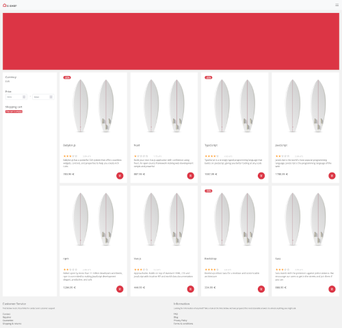

# Vue/Nuxt e-commerce

e-commerce website with 3D capabilities

## Build Setup

```bash
# install dependencies
$ npm install

# serve with hot reload at localhost:3000
$ npm run dev

# build for production and launch server
$ npm run build
$ npm run start

# generate static project
$ npm run generate
```

For detailed explanation on how things work, check out the [documentation](https://nuxtjs.org).

## Motivation

Knowledge of Vue and Nuxt is highly regarded in the front-end field! Most of the Vue/Nuxt projects I've seen so far aren't use all the [features](https://typescript.nuxtjs.org) and [modules](https://modules.nuxtjs.org) the [documentation](https://nuxtjs.org/docs/get-started/installation) has to offer. In general, to make things more interesting, I also decided to port a combination of [Nuxt](https://nuxtjs.org) and [Babylon.js](https://www.babylonjs.com).



## License

GNU General Public License v3.0 - See the [LICENSE](https://github.com/ncklinux/onBoard/blob/master/LICENSE) file in this project for details.

## Disclaimer

This project is distributed FREE & WITHOUT ANY WARRANTY. Report any bugs or suggestions here as an [issue](https://github.com/ncklinux/onBoard/issues/new).

## Contributing

It's best to open an [issue](https://github.com/ncklinux/onBoard/issues/new). It's even better to accompany it with a Pull Request ;)

## Commit Messages

This repository follows the [Conventional Commits](https://www.conventionalcommits.org) specification, the commit message should never exceed 100 characters and must be structured as follows:

```
<type>[optional scope]: <description>

[optional body]

[optional footer(s)]
```

## Note

Gonna keep this project as open source forever! [Watch this repo](https://github.com/ncklinux/onBoard/subscription), Star it and follow me on [GitHub](https://github.com/ncklinux) and [Twitter](https://twitter.com/ncklinux)

## Resources

3D Surfboard by me on [Blender](https://www.blender.org)  
[Image by macrovector](https://www.freepik.com/free-vector/realistic-blank-surfboard_13153587.htm#query=surfboard&position=11&from_view=keyword) on Freepik  
Set of icons [Devicon](https://devicon.dev)

## Frameworks, programming languages, development and design tools


